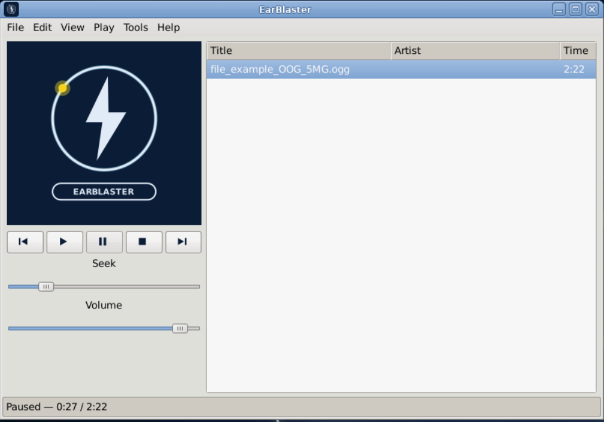
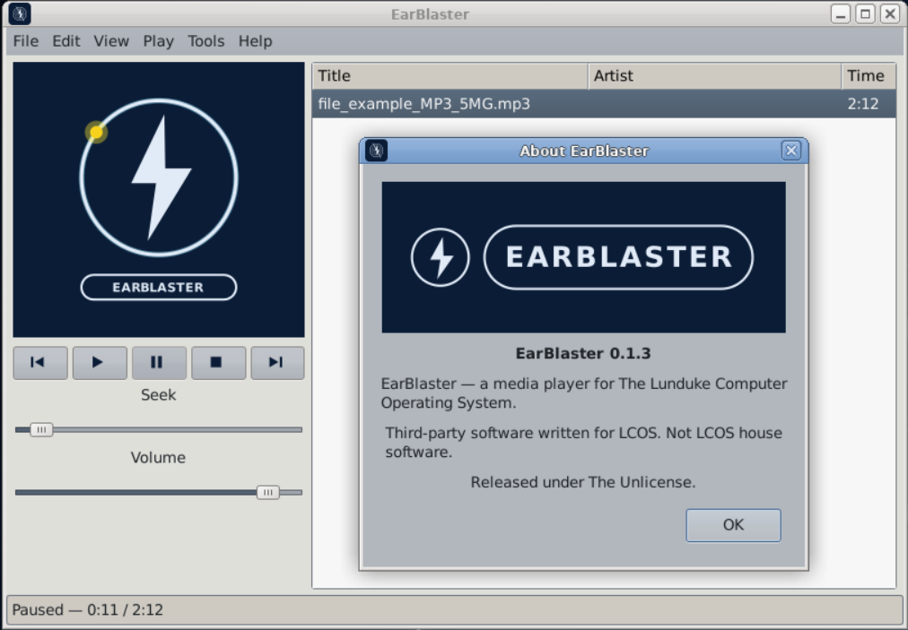
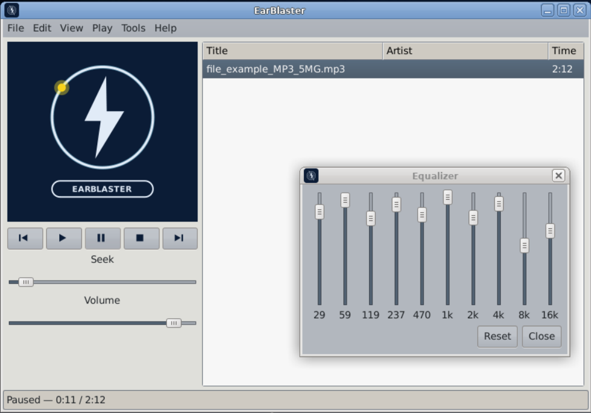
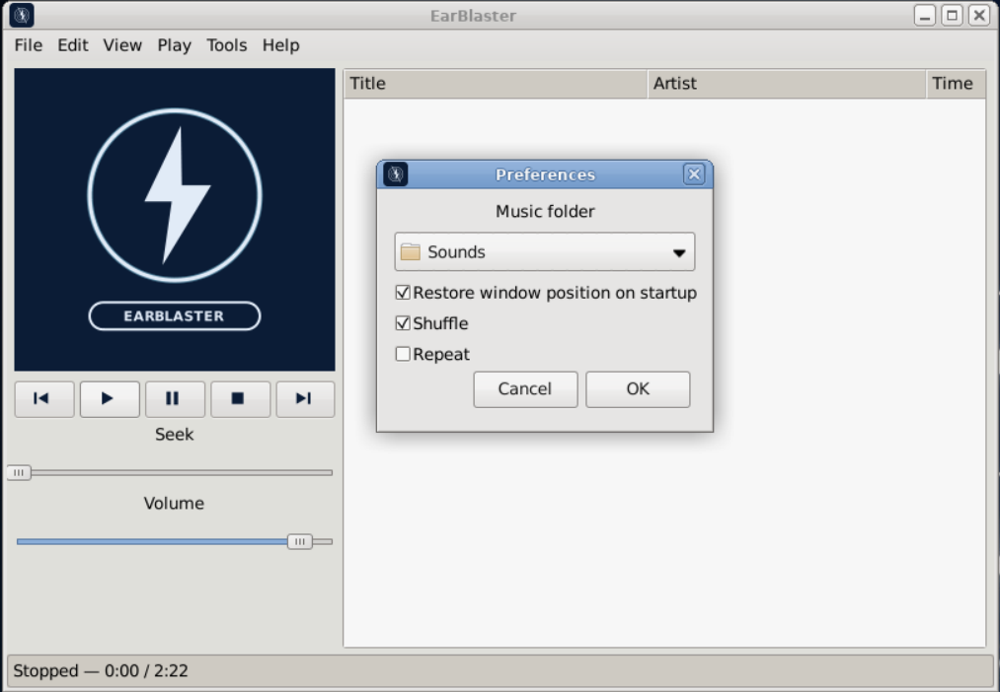

# EarBlaster

**Vended by Grok Build**

A media player **for The Lunduke Computer Operating System (LCOS)**.



Third-party software written to live on that desktop: XFCE, XLibre, Clearlooks chrome, no systemd, no online account, no AI features. It is not a port of an existing Linux player and it is not LCOS house software.

LCOS itself: [https://github.com/BryanLunduke/LCOS](https://github.com/BryanLunduke/LCOS)

Current release: **[0.1.3](https://github.com/gmgauthier/earblaster/releases/tag/v0.1.3)** (2026-09-09).

## What it is

EarBlaster is a single-window **audio** player in the Windows Media Player 7 shape. VLC stays the LCOS video player.

- C++17, gtkmm-3.0, GTK3 CSS, Meson
- GStreamer 1.0 `playbin` — audio only (`video-sink` is `fakesink`)
- Formats: MP3, Ogg, FLAC, WAV, M4A at minimum (`.deb` uses distro plugins; AppImage uses bundled plugins)
- One skin (`lcos`): navy well + ice-white neon
- Spinning single-ring lightning mark while a track plays; yellow bead at 1 rev/s
- Cover art after one bead lap: TagLib embedded picture, then sidecar `folder.jpg` / `cover.jpg` / `AlbumArt.jpg`, then `GST_TAG_IMAGE`. Stretch-fills the well. Stop restores the mark.
- Playlist verbs are **New** (replace the list and start) vs **Add** (append, leave transport). Files, folders (one album level), M3U, drag-and-drop. Double-click plays that row.
- 10-band EQ (`equalizer-10bands`), shuffle, repeat
- Preferences: music folder, restore window, shuffle, repeat
- Single instance: a second launch focuses the existing window
- Config: `~/.config/earblaster/earblaster.ini`
- Local files only in the default build

It borrows LCOS colours. It does **not** use Bryan Lunduke’s official seal. The product mark is the ring-and-bolt; the wordmark is the EARBLASTER pill.







## Status

**M0–M6 are in the tree.** Window, spin, sound, playlist, cover, EQ/prefs/keyboard, and packaging (`debian/`, `scripts/release.sh`). Tagged **0.1.3** (AppImage uses only bundled GStreamer; do not mix with the host).

The development plan called v1.0 “M0 through M6.” That feature set is what 0.1.x ships. A later tag can be named 1.0 when the package has lived on an LCOS box for a bit.

| File | What |
|---|---|
| [INSTALL.md](INSTALL.md) | `.deb`, tarball, AppImage, and from-source install |
| [DEVELOPMENT.md](DEVELOPMENT.md) | Locked decisions, architecture, milestones |
| [brand/](brand/) | Official marks and the UI reference |

Not in this release (parked in DEVELOPMENT.md): spectrum ring, playlist cover column, CUE sheets, MPRIS, gapless, CDDA, WinAmp skins.

## Install

Preferred on LCOS / Devuan / Debian — a release `.deb`:

```
sudo apt install ./earblaster_0.1.3-1_amd64.deb
```

Assets live on the [Releases](https://github.com/gmgauthier/earblaster/releases) page. AppImage and source tarball are documented in [INSTALL.md](INSTALL.md). Config is `~/.config/earblaster/earblaster.ini`.

### AppImage and `APPDIR`

The AppImage **bundles** libgstreamer and plugins from the Debian build host. On start, if `APPDIR` is set, EarBlaster points GStreamer at `$APPDIR/usr/lib/gstreamer-1.0` only and uses a private plugin registry (`~/.cache/gstreamer-1.0/earblaster-appimage.bin`). That avoids loading the host’s plugins against the bundled library (Arch’s `libgstplayback.so` vs Debian’s libgstreamer failed with `undefined symbol: gst_log_context_get_category`).

**Normal run** — the AppImage runtime sets `APPDIR` for you:

```
chmod +x EarBlaster-0.1.3-x86_64.AppImage
./EarBlaster-0.1.3-x86_64.AppImage
```

**Extracted tree** — if you unpack it (`--appimage-extract`), you must set `APPDIR` to that tree or GStreamer will use the host and you can hit the same mismatch:

```
./EarBlaster-0.1.3-x86_64.AppImage --appimage-extract
export APPDIR="$PWD/squashfs-root"
"$APPDIR/AppRun"
# or: "$APPDIR/usr/bin/earblaster"
```

Do **not** point `APPDIR` at `/usr` or at a native prefix. Leave it unset for `.deb` and from-source builds.

## Brand

Palette: navy `#0B1D38`, ice `#E8F2FF`, client gray `#E6E6E1`.

- `brand/mark-ring-bolt.svg` — spinning well mark
- `brand/icon-tile.svg` — desktop / menu icon
- `brand/lockup-pill.svg` — About box lockup
- `brand/screenshot-playback.png` — LCOS window (hero image above)
- `brand/screenshot-about.png` `screenshot-equalizer.png` `screenshot-preferences.png` — About, EQ, Preferences on LCOS
- `brand/ui-reference.svg` — locked layout mock (not a live screenshot)

Grammar and file list: [brand/README.md](brand/README.md)

About box line:

> EarBlaster — a media player for The Lunduke Computer Operating System.

## Target

LCOS (Devuan + XLibre + XFCE4). Build on any current Devuan/Debian box; ship as a `.deb` under the LCOS package layout.

## Build

```
sudo apt install \
  build-essential meson ninja-build pkg-config g++ \
  libgtkmm-3.0-dev \
  libgstreamer1.0-dev libgstreamer-plugins-base1.0-dev \
  gstreamer1.0-plugins-good gstreamer1.0-plugins-ugly \
  gstreamer1.0-libav \
  libtag-dev

meson setup build
meson compile -C build
./build/earblaster
```

The uninstalled binary finds CSS and brand files via `SOURCE_ROOT`. `EARBLASTER_DATA` overrides that.

Keyboard while the window is focused: Space play/pause, Left/Right seek ±5s, Delete remove selected rows.

## License

[The Unlicense](https://unlicense.org). Public domain. See [UNLICENSE](UNLICENSE).
